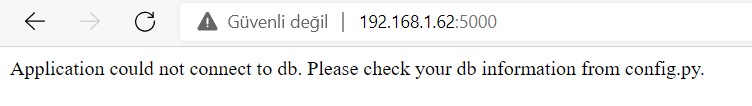
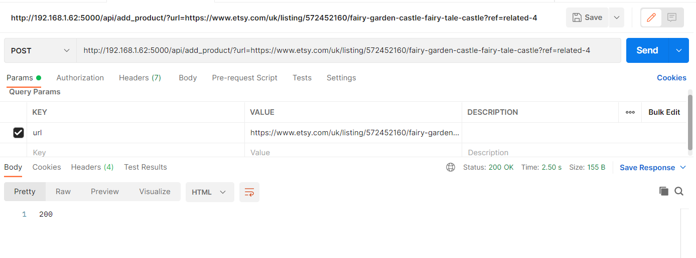
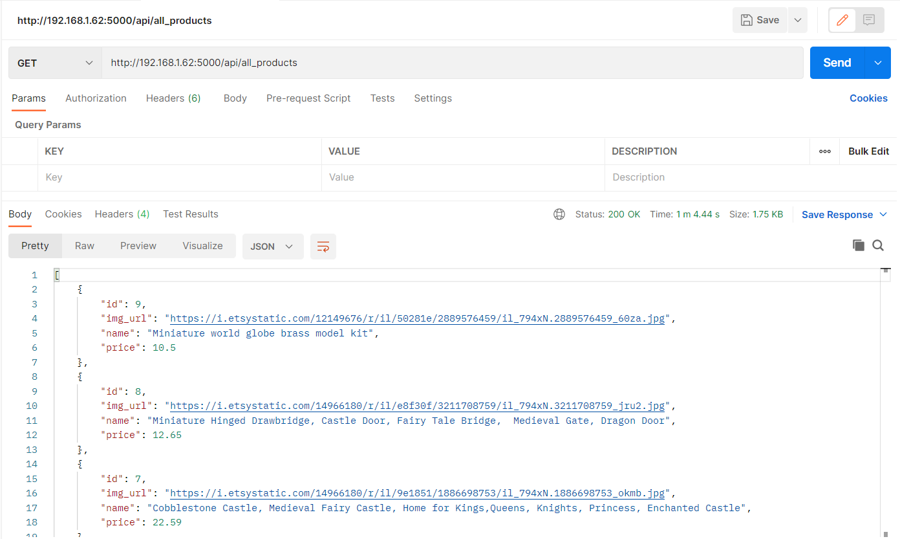
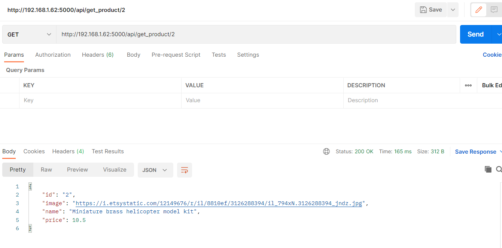
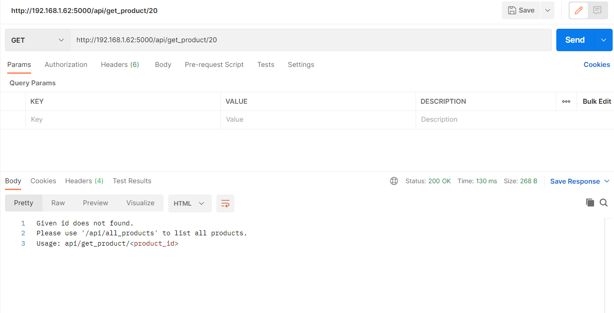

etsy-scrapper

It takes the product URL belonging to ETSY and scrapes the product information from the site (name, main image url and price).
It saves this information in MYSQL database. 
Shows the product detail when it is selected. 

<h2>USAGE</h2>

Install requirements from requirements.txt using pip install -r requirements.txt   
Change your db information from config.py.  
<h4>Encountered error if the config.py does not set</h4>

Run app/app.py file to use web application. 
Dockerization does not work for now. Mysql connection could not complated.

<h3>Usage as an api</h3>
<li>Adding new product </li>
http://192.168.1.62:5000/api/add_product/?url=etsy_url
 Returns '200' if operation was successfull, else returns '500'

<li>Listing all products</li>
http://192.168.1.62:5000/api/all_products

<li>Get a specific product</li>
http://192.168.1.62:5000/api/get_product/product_id

<h2>Listing the Products From Database</h2>

<h2>Viewing the Product's Detail</h2>

<h2>Searching Result</h2>

<h2>MYSQL DB Products Table</h2>

