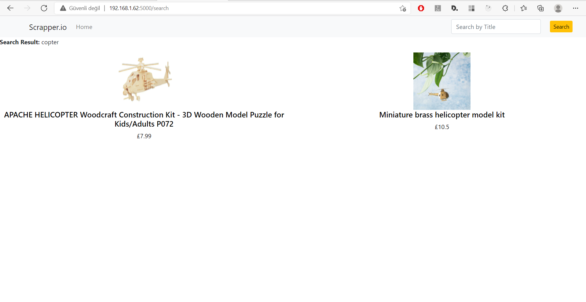
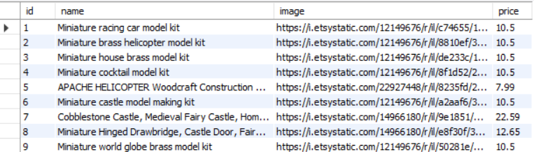

etsy-scrapper

It takes the product URL belonging to ETSY and scrapes the product information from the site (name, main image url and price).
It saves this information in MYSQL database. 
Shows the product detail when it is selected. 

<h2>USAGE</h2>
Run app/app.py file to use web application. 
Dockerization does not work for now.

<h2>Listing the Products From Database</h2>

<h2>Viewing the Product's Detail</h2>

<h2>Searching Result</h2>

<h2>MYSQL DB Products Table</h2>

