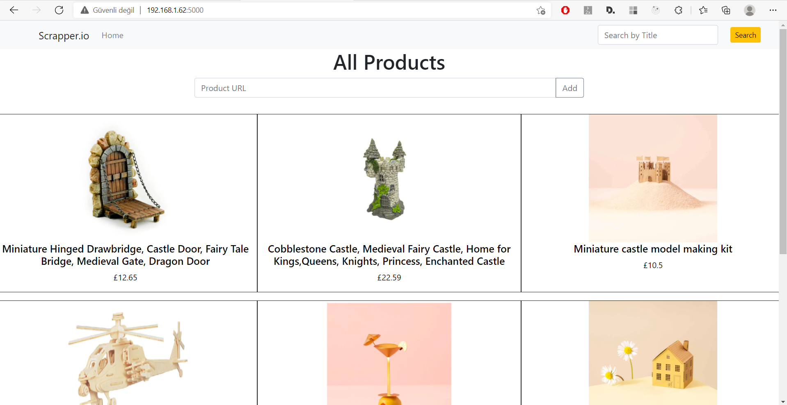
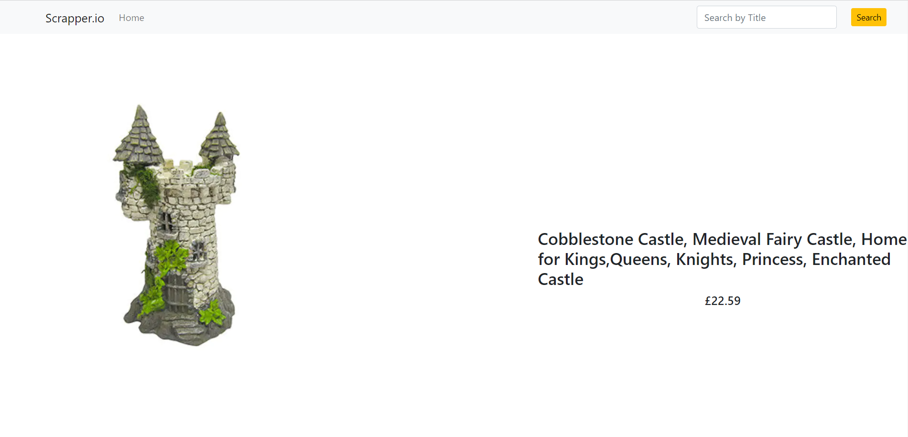

etsy-scrapper

It takes the product URL belonging to ETSY and scrapes the product information from the site (name, main image url and price).
It saves this information in MYSQL database. 
Shows the product detail when it is selected. 

<h2>Listing the products from database</h2>

<h2>Viewing the product's detail</h2>

